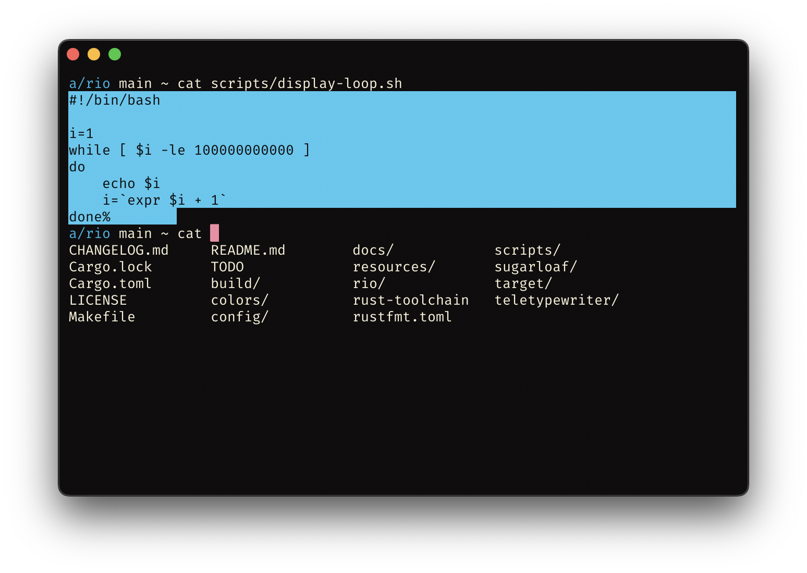
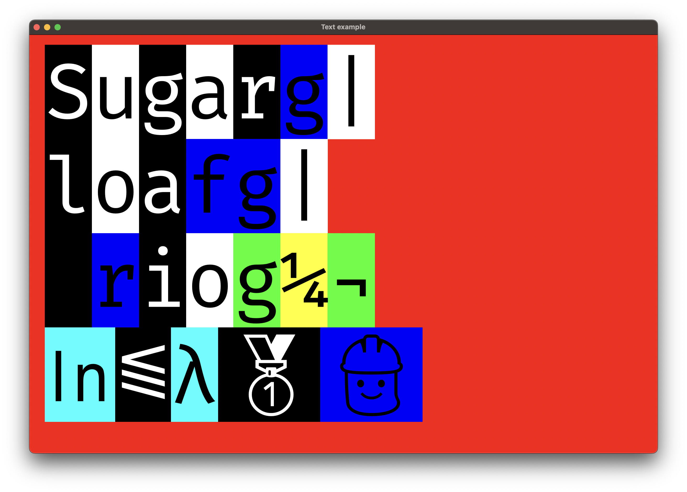

# Rio term

> tl;dr: Rio is a terminal built to run everywhere, as a native desktop applications by Rust/WebGPU or even in the browser powered by WebAssembly/WebGPU.

## Development Status

Rio current development version is `0.0.4`.

Basic features are under development for MacOs right now.

| Platform | Development Status | Release plan |
| --- | --- | --- |
| MacOs _as desktop application_ | In development 👷 | `0.1.0` |
| Web Browser _(WebAssembly)_ | In development 👷 | `0.2.0` |
| Linux _as desktop application_ | In development 👷 * | TBD |
| Windows _as desktop application_ | Not started yet | --- |
| Nintendo Switch * | Not started yet | --- |

_* Development and tests are targeting Wayland, probably is not stable on X11 yet._

_* Nintendo Switch development is just for fun, the goal is to have  the renderer working and the basic features of a terminal._

## Demo Gallery

|  |  |
| ----------- | ----------- |
|  |  |
|  |  |

Note: Emojis are rendered with Noto Emoji.

## Sugarloaf

Rio is built over a custom renderer called [Sugarloaf](https://crates.io/crates/sugarloaf), which is responsible for font and style rendering. Sugarloaf demo:

## Summary

- [About Rio](#about-rio)
- [Status](#development-status)
- [Configuration file](#configuration-file)
- [Acknowledgments](#acknowledgments)

## About Rio

Website: https://raphamorim.io/rio

> If you are using or want to help in any way please consider to donate via [Github Sponsors](https://github.com/sponsors/raphamorim).
> 
> Rio would not be possible without [few acknowledgements](#acknowledgements) and specially [Alacritty](https://github.com/alacritty/alacritty/), since a lot of Rio functionalities (e.g: ANSI parser, events, grid system) was originally written (and still uses a good amount) of Alacritty code.
>

Read about Rio in the official website: https://raphamorim.io/rio/docs.

## Configuration File

Configuration file is documented in Rio official website: https://raphamorim.io/rio/docs#configuration-file.

## Acknowledgments

- Alacritty 🥇
- Rio logo was made using _Adobe Sketchbook_ on iPad.
- The default color palette is based on the colors of [ui.dev](https://ui.dev/).
- Text glyph render is from https://github.com/hecrj/wgpu_glyph
- https://github.com/wez/wezterm
- https://www.gaijin.at/en/infos/ascii-ansi-character-table#asciicontrol
- https://en.wikipedia.org/wiki/ANSI_escape_code
- https://www.scratchapixel.com/lessons/3d-basic-rendering/perspective-and-orthographic-projection-matrix/orthographic-projection-matrix.html