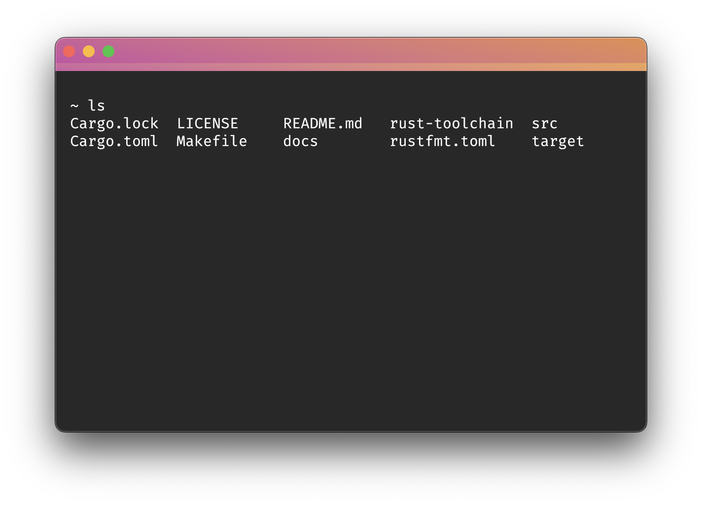
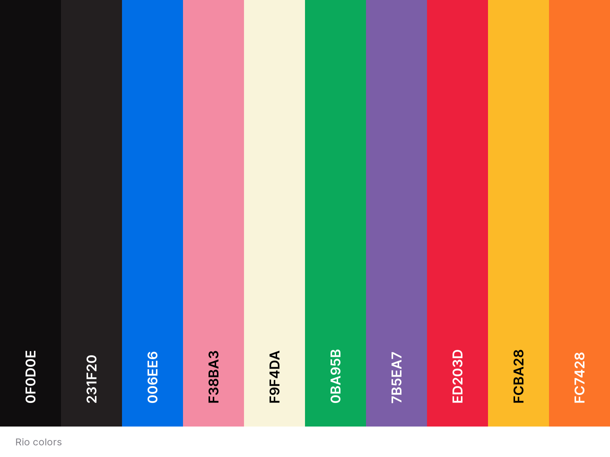

# Rio term

> tl;dr: Rio is a terminal built to run everywhere, as a native desktop applications by Rust/WebGPU or even in the browser powered by WebAssembly/WebGPU.


## Demo



## Summary

- [About Rio](#about-rio)
- [Configuration file](#configuration-file)
    - [Performance](#performance)
    - [Height](#height)
    - [Width](#width)
    - [Style](#style)
    - [Advanced](#advanced)
    - [Colors](#colors)
    - [Developer](#developer)
- [Status](#development-status)
- [Acknowledgments](#acknowledgments)

## About Rio

Website: https://raphamorim.io/rio

> If you are using or want to help in any way please consider to donate via [Github Sponsors](https://github.com/sponsors/raphamorim).
> 
> Rio would not be possible without [few acknowledgements](#acknowledgements) and specially [Alacritty](https://github.com/alacritty/alacritty/), since a lot of Rio functionalities (e.g: ANSI parser, events, grid system) was originally written (and still uses a good amount) of Alacritty code.
>

A terminal application that's built with Rust, WebGPU, Tokio runtime. It targets to have the best frame per second experience as long you want, but is also configurable to use as minimal from GPU.

Below some of work in progress Rio's features:

- Renderer based on Redux state machine.
- WebAssembly plugin system.
- Cross-platform.
- Configurable (Render level, colors, icons, fonts).
- Offloads rendering to the GPU for lower system load.
- Uses threaded rendering for absolutely minimal latency.
- Tabs support.

Rio renderer is based on redux state machine, lines that has not updated will not suffer a redraw. Looking for the minimal rendering process in most of the time. Rio is also designed to support WebAssembly runtime so in the future you will be able to define how a tab system will work with a WASM plugin written in your favorite language.

Rio uses WGPU, which is an implementation of WebGPU for use outside of a browser and as backend for firefox's WebGPU implementation. WebGPU allows for more efficient usage of modern GPU's than WebGL. **[More info](https://users.rust-lang.org/t/what-is-webgpu-and-is-it-ready-for-use/62331/8)**

It also relies on Rust memory behavior, since Rust is a memory-safe language that employs a compiler to track the ownership of values that can be used once and a borrow checker that manages how data is used without relying on traditional garbage collection techniques. **[More info](https://stanford-cs242.github.io/f18/lectures/05-1-rust-memory-safety.html)**

## Configuration File

The configuration should be the following paths otherwise Rio will use the default configuration.

- macOS path: `~/.rio/config.toml`

Default configuration of `config.toml`:

```toml
# Rio default configuration file
performance = "High"
height = 438
width = 662

[style]
font = "Monaco"
font-size = 16
theme = "Basic"

[advanced]
tab-character-active = '●'
tab-character-inactive = '■'
disable-renderer-when-unfocused = false

[developer]
enable-fps-counter = false
log-level = 'OFF'

[colors]
background       = '#0F0D0E'
black            = '#231F20'
blue             = '#006EE6'
cursor           = '#F38BA3'
cyan             = '#88DAF2'
foreground       = '#F9F4DA'
green            = '#0BA95B'
magenta          = '#7B5EA7'
red              = '#ED203D'
tabs             = '#F9C5D1'
tabs-active      = '#FC7428'
white            = '#F1F1F1'
yellow           = '#FCBA28'
dim-black        = '#1C191A'
dim-blue         = '#0E91B7'
dim-cyan         = '#93D4E7'
dim-foreground   = '#ECDC8A'
dim-green        = '#098749'
dim-magenta      = '#624A87'
dim-red          = '#C7102A'
dim-white        = '#C1C1C1'
dim-yellow       = '#E6A003'
light-black      = '#2C2728'
light-blue       = '#44C9F0'
light-cyan       = '#7BE1FF'
light-foreground = '#F2EFE2'
light-green      = '#0ED372'
light-magenta    = '#9E88BE'
light-red        = '#F25E73'
light-white      = '#FFFFFF'
light-yellow     = '#FDF170'
```

#### `performance`

Set terminal WGPU rendering perfomance.

- High: Adapter that has the highest performance. This is often a discrete GPU.
- Low: Adapter that uses the least possible power. This is often an integrated GPU.

See more in https://docs.rs/wgpu/latest/wgpu/enum.PowerPreference.html

```toml
# <performance> Set WGPU rendering perfomance
# default: High
# options: High, Low
# High: Adapter that has the highest performance. This is often a discrete GPU.
# Low: Adapter that uses the least possible power. This is often an integrated GPU.
performance = "High"
```

#### `height`

Set terminal window height.

```toml
# <height> Set default height
# default: 438
height = 400
```

#### `width`

Set terminal window width.

```toml
# <width> Set default width
# default: 662
width = 800
```

#### `cursor`

Set cursor character.

```toml
# default: '█'

# (Underline)
cursor: '_'

# (Beam)
cursor: '|'

# Other possibilities
cursor: '❤' # (U+2764)
```

### Style

#### `font`

If the font family in the system isn't found will fallback to a pre-built "Firamono".

```toml
[style]
font = "Monaco"
```

#### `font-size`

Sets font size.

```toml
[style]
font-size = 16.0
```

### Advanced

#### `tab-character-active`

This property sets a `char` for an active tab.

```toml
[style]
tab-character-active = '●'
```

#### `tab-character-inactive`

This property sets a `char` for an inactive tab.

```toml
[style]
tab-character-inactive = '■'
```

#### `disable-renderer-when-unfocused`

This property disable renderer processes until focus on Rio term again.

```toml
[style]
disable-renderer-when-unfocused = false
```

## Developer

#### `log-level`

This property enables log level filter. Default is `OFF`.

```toml
[style]
log-level = 'INFO'
```

#### `enable-fps-counter`

This property enables frame per second counter.

```toml
[style]
enable-fps-counter = false
```

## Colors

Rio default colors:



> The image above was produced by [coolors.co](https://coolors.co/).

Usage example running the following bash script:

```bash
for x in {0..8}; do
    for i in {30..37}; do
        for a in {40..47}; do
            echo -ne "\e[$x;$i;$a""m\\\e[$x;$i;$a""m\e[0;37;40m "
        done
        echo
    done
done
echo ""
```

Or one-liner:

```bash
for x in {0..8}; do for i in {30..37}; do for a in {40..47}; do echo -ne "\e[$x;$i;$a""m\\\e[$x;$i;$a""m\e[0;37;40m "; done; echo; done; done; echo ""
```

## Development Status

Basic features are under development for MacOs right now.

| Platform | Development Status |
| --- | --- |
| MacOs _as desktop application_ | In development 👷 |
| Linux _as desktop application_ | In development 👷 * |
| Windows _as desktop application_ | Not started yet |
| Web Browser _(tests on Chrome and Firefox)_ | Not started yet |
| Nintendo Switch | Not started yet |

_* Development and tests are targeting Wayland, probably is not stable on X11 yet._

## Acknowledgments

- Rio logo was made using _Adobe Sketchbook_ on iPad.
- The default color palette is based on the colors of [ui.dev](https://ui.dev/).
- Text glyph render is from https://github.com/hecrj/wgpu_glyph
- https://github.com/wez/wezterm
- https://www.gaijin.at/en/infos/ascii-ansi-character-table#asciicontrol
- https://en.wikipedia.org/wiki/ANSI_escape_code
- https://www.scratchapixel.com/lessons/3d-basic-rendering/perspective-and-orthographic-projection-matrix/orthographic-projection-matrix.html