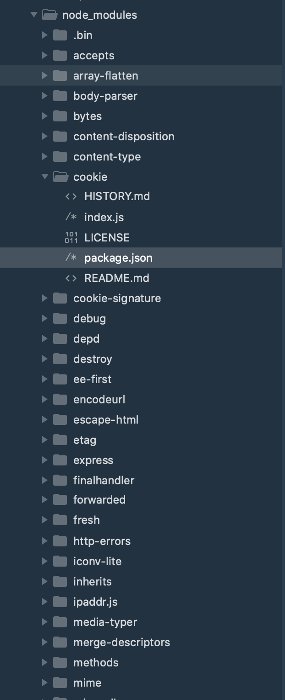
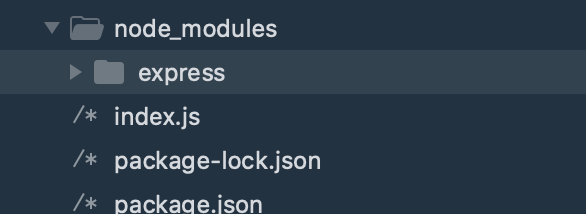

# Rio

Rio is an opinated package manager built with Rust.

## Reasons

### Package Scoping

Let's say that you want to install express to a brand new project, so you run `npm install express@4.17.1`. Once that's done and then you want to check the node_modules scope, you're gonna see all the express dependencies in the runtime scope, for example:

```sh
$ node -e "console.log(require('cookie'))"
{ parse: [Function: parse], serialize: [Function: serialize] }
```

* This test was made using npm 6.14.2.

`node_modules` dependecies tree:



**index.js**

```js
console.log(require('bytes'))
console.log(require('destroy'))
console.log(require('ee-first'))
```

```
$ node index.js
[Function: bytes] {
  format: [Function: format],
  parse: [Function: parse]
}
[Function: destroy]
[Function: first]
```

Rio is suitable to avoid this package scoping issue.



## Benchmark

This test is using a lots of files (inspired by [Benchmarks of JavaScript Package Managers](https://github.com/pnpm/benchmarks-of-javascript-package-managers/blob/master/README.md))

| action  | npm | pnpm | Yarn | Rio |
| ---     | --- | --- | --- | --- |
| fresh install with over many dependencies | 6.6s | 22.4s | 35s | 2.2s |
| install with cache over many dependencies  | 2.9s	 | 1.3s | 694ms | 230ms |

## Packages for real

```
 $ rio install ->
    - check dependencies
    - request rio.source.com for each processed dependency
      -> dependency exists in .rio format (gzip data + info)
        - fetch gzipped dependency (for each rio publish, it process and compress the package to .rio format)
      -> if the dependency doesn't exist:
        - process & pack the dependency asynchronously and notify the user to attemp again in an estimated time
```

## Universal cache

Each package is saved and it's shared across all JS projects, reducing redudance and if exists

## New package.json format

```js
 "dependencies": {
    "@babel/runtime": "https://github.com/babel/babel/tree/master/packages/babel-runtime", // always updated
    "react": "16.12.0" // load gzip package
```


## Commands && Arguments

#### `--version`

Display the Rio version.

```bash
$ rio --version
Rio 0.1.0
```

#### `--help`

Display the Rio available commands.

```bash
$ rio --version
Rio 0.1.0
Raphae Amorim <rapha850@gmail.com>
JavaScript Package Manager

USAGE:
    rio <install>

FLAGS:
    -h, --help       Prints help information
    -V, --version    Prints version information

ARGS:
    <install>    install packages
```

## Development

- `cd rio && cargo run`
