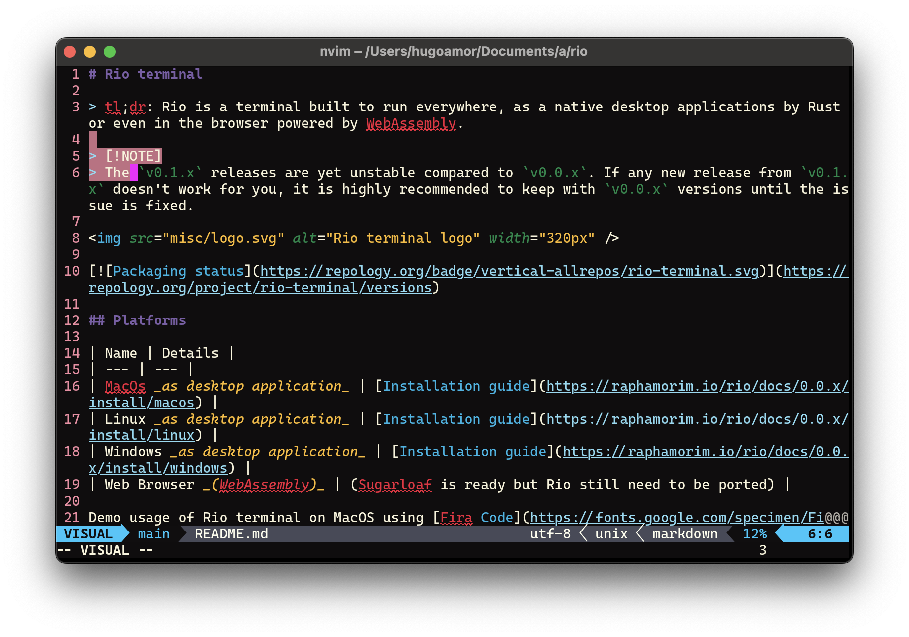

# Rio terminal

> tl;dr: Rio is a terminal built to run everywhere, as a native desktop applications by Rust or even in the browser powered by WebAssembly.

## Platforms

| Name | Details |
| --- | --- |
| MacOs _as desktop application_ | [Installation guide](https://raphamorim.io/rio/docs/install/macos/) |
| Linux _as desktop application_ | [Installation guide](https://raphamorim.io/rio/docs/install/linux/) |
| Windows _as desktop application_ | [Installation guide](https://raphamorim.io/rio/docs/install/windows/) |
| Web Browser _(WebAssembly)_ | (Sugarloaf is ready but Rio still need to be ported) |

> Demo with split and CRT on MacOS

> Demo with default configuration on MacOS

> Demo with blurred background on Linux

## About

Documentation: https://raphamorim.io/rio

If you are using or want to help in any way please consider to donate via [Github Sponsors](https://github.com/sponsors/raphamorim).

Rio would not be possible without [few acknowledgements](#acknowledgments) and specially [Alacritty](https://github.com/alacritty/alacritty/), since a lot of Rio functionalities (e.g: ANSI parser, events, grid system) was originally written (and still uses a good amount) of Alacritty code.

## Supporting the Project

If you use and like Rio, please consider sponsoring it: your support helps to cover the fees required to maintain the project and to validate the time spent working on it!

* 

## Acknowledgments

- Alacritty 🥇
- Since version 0.0.22, Sugarloaf ported glyph-brush code which was originally written by @alexheretic and licensed under Apache-2.0 license 🥇
- Components text render was originally from https://github.com/hecrj/wgpu_glyph
- The legacy Rio logo was made using _Adobe Sketchbook_ on iPad (between versions 0.0.1 between 0.0.18).
- WA was built originally from a fork from [Macroquad](https://github.com/not-fl3/macroquad) which is licensed under MIT license.
- https://github.com/servo/core-foundation-rs/blob/d4ce710182f1756c9d874ab917283fe1a1b7a011/cocoa/src/appkit.rs#L1447

## Minimal stable rust version

Rio's MSRV is 1.80.1.