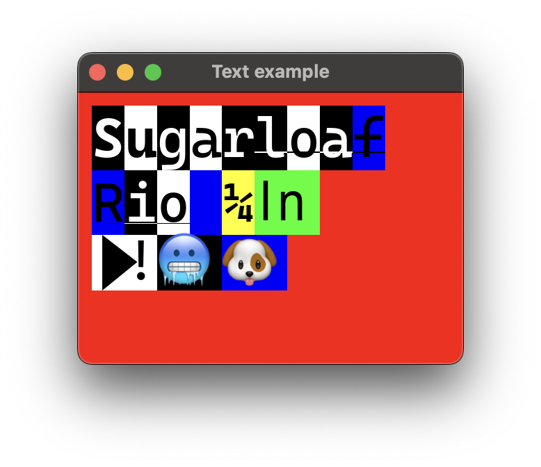

# Rio term

> tl;dr: Rio is a terminal built to run everywhere, as a native desktop applications by Rust/WebGPU or even in the browser powered by WebAssembly/WebGPU.

## Platforms

| Name | Details |
| --- | --- |
| MacOs _as desktop application_ | [Installation guide](https://raphamorim.io/rio/install/#macos) |
| Linux _as desktop application_ | [Installation guide](https://raphamorim.io/rio/install/#linux) |
| Windows _as desktop application_ | [Installation guide](https://raphamorim.io/rio/install/#windows) |
| Web Browser _(WebAssembly)_ | (Sugarloaf is ready but Rio still need to be ported) |
| Nintendo Switch * | (development hasn't started) |

_* Nintendo Switch development is just for fun, the goal is to have  the renderer working and the basic features of a terminal._

## Demo Gallery

|  |  |
| ----------- | ----------- |
|  |  |
|  | |
|  |  |

Note: Emojis are rendered with Noto Emoji.

## Sugarloaf

Rio is built over a custom renderer called [Sugarloaf](https://crates.io/crates/sugarloaf), which is responsible for font and style rendering. Sugarloaf demo:

|  |  |
| ----------- | ----------- |
|  |  |
|  |  |

## About

Documentation: https://raphamorim.io/rio

If you are using or want to help in any way please consider to donate via [Github Sponsors](https://github.com/sponsors/raphamorim).

Rio would not be possible without [few acknowledgements](#acknowledgements) and specially [Alacritty](https://github.com/alacritty/alacritty/), since a lot of Rio functionalities (e.g: ANSI parser, events, grid system) was originally written (and still uses a good amount) of Alacritty code.

## Supporting the Project

If you use and like Rio, please consider sponsoring it: your support helps to cover the fees required to maintain the project and to validate the time spent working on it!

* 
* [Patreon](https://patreon.com/raphamorim)

## Acknowledgments

- Alacritty 🥇
- Rio logo was made using _Adobe Sketchbook_ on iPad.
- The default color palette is based on the colors of [ui.dev](https://ui.dev/).
- Text glyph render is from https://github.com/hecrj/wgpu_glyph
- https://github.com/wez/wezterm
- https://www.gaijin.at/en/infos/ascii-ansi-character-table#asciicontrol
- https://en.wikipedia.org/wiki/ANSI_escape_code
- https://www.scratchapixel.com/lessons/3d-basic-rendering/perspective-and-orthographic-projection-matrix/orthographic-projection-matrix.html
