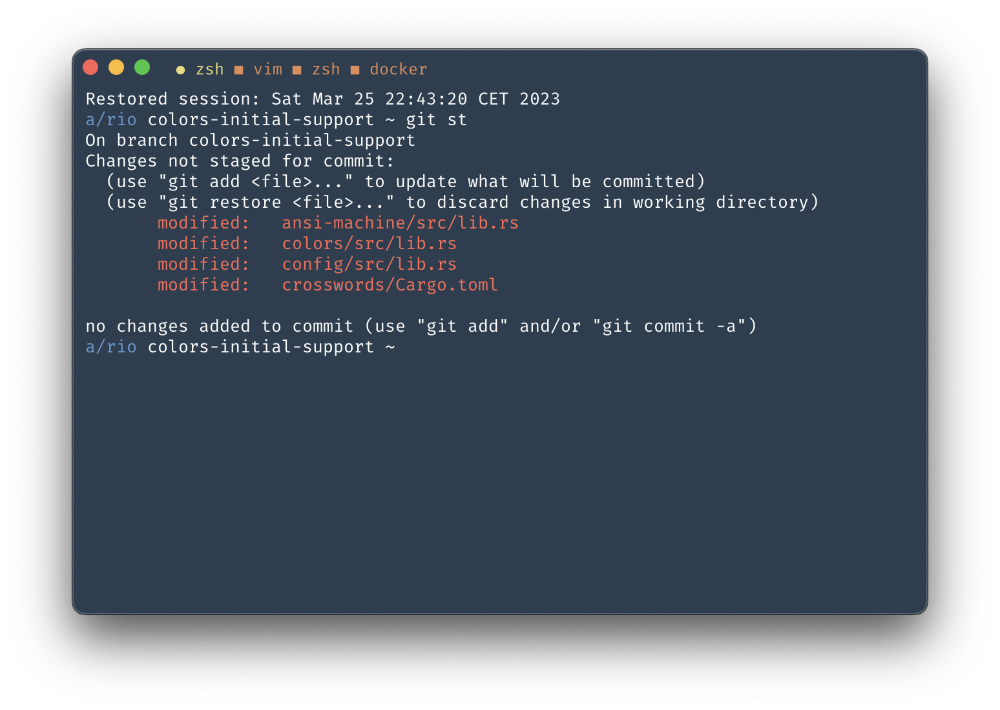

# Rio: ⚡ terminal app 

> Example using [Lucario color scheme](github.com/raphamorim/lucario/).



## Summary

- [About Rio](#about-rio)
- [Configuration file](#configuration-file)
    - [Performance](#performance)
    - [Height](#height)
    - [Width](#width)
    - [Style](#style)
    - [Advanced](#advanced)
    - [Colors](#colors)
- [Status](#development-status)
- [Acknowledgments](#acknowledgments)

## About Rio

Website: https://raphamorim.io/rio

> If you are using or want to help in any way please consider to donate via [Github Sponsors](https://github.com/sponsors/raphamorim).
> 
> Rio would not be possible without [few acknowledgements](#acknowledgements).
> 

A terminal application that's built with Rust, WebGPU, Tokio runtime. It targets to have the best frame per second experience as long you want, but is also configurable to use as minimal from GPU.

Below some of Rio's features:

- Cross-platform.
- Configurable (Render level, colors, icons, fonts).
- Offloads rendering to the GPU for lower system load.
- Uses threaded rendering for absolutely minimal latency.
- Tabs support.

Rio uses WGPU, which is an implementation of WebGPU for use outside of a browser and as backend for firefox's WebGPU implementation. WebGPU allows for more efficient usage of modern GPU's than WebGL. **[More info](https://users.rust-lang.org/t/what-is-webgpu-and-is-it-ready-for-use/62331/8)**

It also relies on Rust memory behavior, since Rust is a memory-safe language that employs a compiler to track the ownership of values that can be used once and a borrow checker that manages how data is used without relying on traditional garbage collection techniques. **[More info](https://stanford-cs242.github.io/f18/lectures/05-1-rust-memory-safety.html)**

## Configuration File

The configuration should be the following paths otherwise Rio will use the default configuration.

- macOS path: `~/.config/rio.toml`

> `$XDG_CONFIG_HOME` defines the base directory relative to which user specific configuration files should be stored. If `$XDG_CONFIG_HOME` is either not set or empty, a default equal to `$HOME/.config` should be used.

Default configuration of `rio.toml`:

```toml
# Rio default configuration file
performance = "High"
height = 438
width = 662

[style]
font = "Firamono"
font-size = 16
theme = "Basic"

[advanced]
tab-character-active = '●'
tab-character-inactive = '■'
monochrome = false
enable-fps-counter = false
disable-renderer-when-unfocused = false

[colors]
background      = '#151515'
black
blue
cursor          = '#8E12CC'
cyan
foreground      = '#FFFFFF'
green
magenta
red
tabs       
tabs-active     = '#F8A145'
white
yellow
dim-black
dim-blue
dim-cyan
dim-foreground
dim-green
dim-magenta
dim-red
dim-white
dim-yellow
light-black
light-blue
light-cyan
light-foreground
light-green
light-magenta
light-red
light-white
light-yellow
```

#### `performance`

Set terminal WGPU rendering perfomance.

- High: Adapter that has the highest performance. This is often a discrete GPU.
- Low: Adapter that uses the least possible power. This is often an integrated GPU.

See more in https://docs.rs/wgpu/latest/wgpu/enum.PowerPreference.html

```toml
# <performance> Set WGPU rendering perfomance
# default: High
# options: High, Low
# High: Adapter that has the highest performance. This is often a discrete GPU.
# Low: Adapter that uses the least possible power. This is often an integrated GPU.
performance = "High"
```

#### `height`

Set terminal window height.

```toml
# <height> Set default height
# default: 438
height = 400
```

#### `width`

Set terminal window width.

```toml
# <width> Set default width
# default: 662
width = 800
```

#### `columns`

Define the column width of your console window. This mode is system dependant, and returns an error if you specify a column width that is not supported by your operating system.

```toml
# <width> Set default width
# default: 80 (macOs)
columns = 80
```

#### `rows`

Define the row height of your console window. This mode is system dependant, and returns an error if you specify a row height that is not supported by your operating system. 

```toml
# <width> Set default width
# default: 25 (macOs)
rows = 25
```

### Style

#### `font`

This property will change later to an actual font path. Currently Rio has 2 fonts builtin: `Firamono`, `Novamono`.

```toml
[style]
font = "Firamono"
```

#### `font-size`

Sets font size.

```toml
[style]
font-size = 16.0
```

### Advanced

#### `enable-fps-counter`

This property enables frame per second counter.

```toml
[style]
enable-fps-counter = false
```

#### `tab-character-active`

This property sets a `char` for an active tab.

```toml
[style]
tab-character-active = '●'
```

#### `tab-character-inactive`

This property sets a `char` for an inactive tab.

```toml
[style]
tab-character-inactive = '■'
```

#### `disable-renderer-when-unfocused`

This property disable renderer processes until focus on Rio term again.

```toml
[style]
disable-renderer-when-unfocused = false
```

## Colors

Default color palette demo:

Usage example running the following bash script:

```bash
for x in {0..8}; do
    for i in {30..37}; do
        for a in {40..47}; do
            echo -ne "\e[$x;$i;$a""m\\\e[$x;$i;$a""m\e[0;37;40m "
        done
        echo
    done
done
echo ""
```

Or one-liner:

```bash
for x in {0..8}; do for i in {30..37}; do for a in {40..47}; do echo -ne "\e[$x;$i;$a""m\\\e[$x;$i;$a""m\e[0;37;40m "; done; echo; done; done; echo ""
```

## Development Status

Basic features are under development for MacOs right now.

| Platform | Development Status |
| --- | --- |
| MacOs | In development 👷 |
| Linux | Not started yet |
| Windows | Not started yet |

## Acknowledgments

- Term and Grid system was built originally on Alacritty's code https://github.com/alacritty/alacritty/blob/766a3b5582fa8ee13506c0f23c9c145ff0012078/alacritty_terminal/src/grid/mod.rs
- Text glyph render is from https://github.com/hecrj/wgpu_glyph
- https://github.com/wez/wezterm
- https://www.gaijin.at/en/infos/ascii-ansi-character-table#asciicontrol
