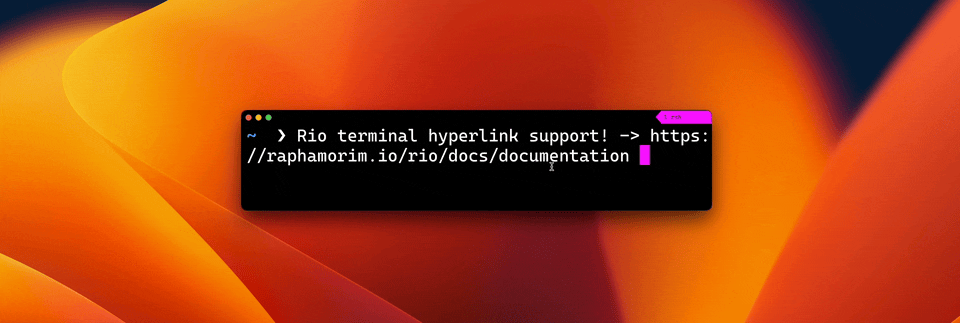
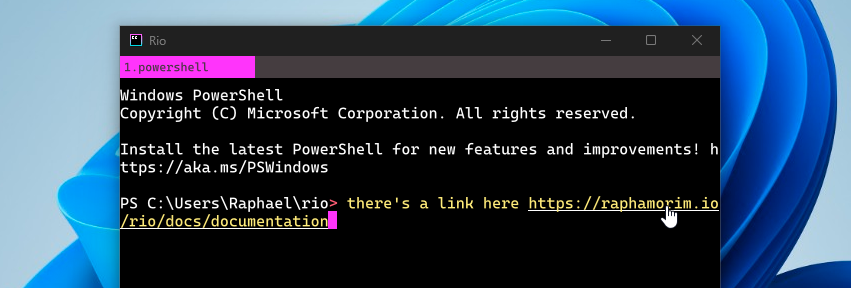
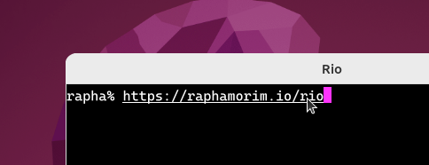

Rio terminal support open hyperlinks from the terminal.

## MacOS

For activate hyperlink feature hold `Command` key whenever hovering a link:

## Windows / Linux / BSD

For activate hyperlink feature hold `alt` key whenever hovering a link:

