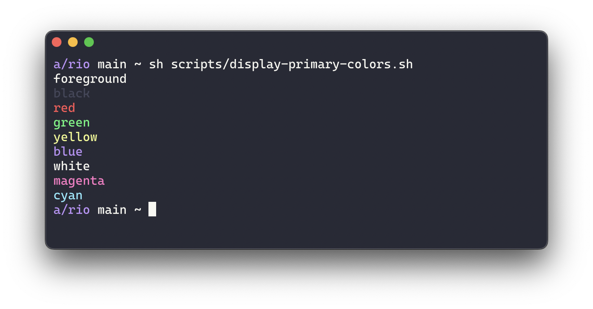
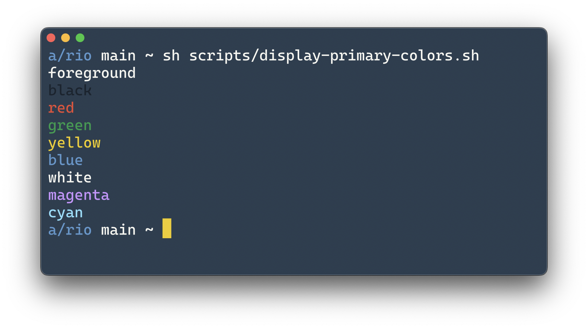

<!-- Hey there!
    Kind reminder to add your theme screenshot image
    Please follow the pattern in the example by using the following command inside of the rio repository root folder:

    $ sh scripts/display-primary-colors.sh
-->

    
Default

    

    <a href="https://github.com/raphamorim/rio-dracula">
        
Dracula

        
    </a>

    <a href="https://github.com/raphamorim/lucario/#rio-terminal">
        
Lucario

        
    </a>

