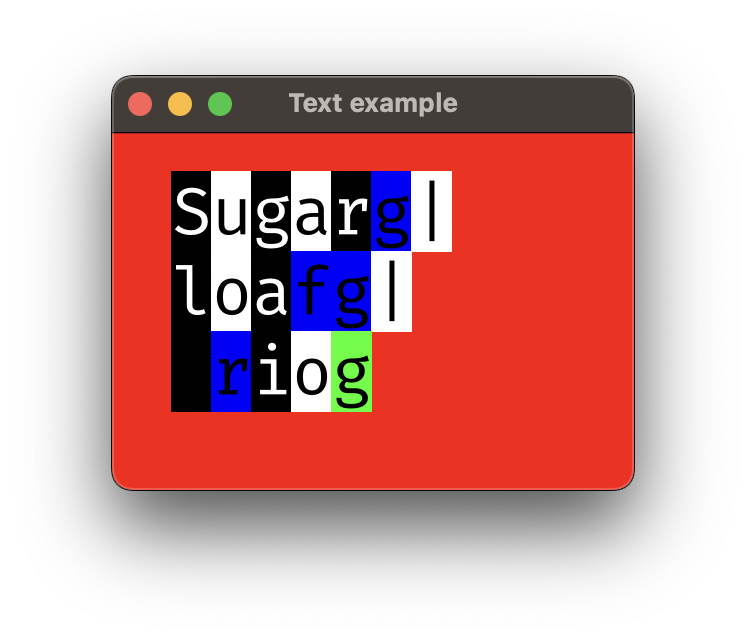

# Sugarloaf

Sugarloaf is Rio rendering engine, desgined to be multiplatform. It is based on WebGPU, Rust library for Desktops and WebAssembly for Web (JavaScript). This project is created and maintaned for Rio terminal purposes but feel free to use it.

## Examples

|  |  |
| ----------- | ----------- |
|  | ... |

### Desktop rect

```bash
cargo run --example rect
```

### Desktop text

```bash
cargo run --example text
```
