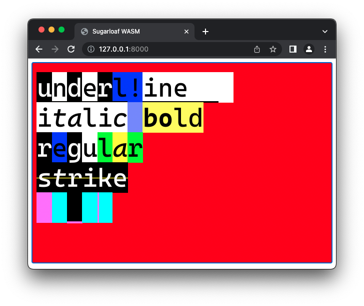

# Sugarloaf

Sugarloaf is Rio rendering engine, desgined to be multiplatform. It is based on WebGPU, Rust library for Desktops and WebAssembly for Web (JavaScript). This project is created and maintaned for Rio terminal purposes but feel free to use it.

### Desktop rect

```bash
cargo run --example rect
```

### Desktop text

```bash
cargo run --example text
```

## Examples

|  |  |
| ----------- | ----------- |
|  |  |
|  |  |
|  | |

## WASM Tests

### Setup

Install `wasm-bindgen-cli` globally: `cargo install wasm-bindgen-cli`.
`wasm-bindgen-cli` provides a test runner harness.

### Running Tests

Run (in the root sugarloaf directory):

```
CARGO_TARGET_WASM32_UNKNOWN_UNKNOWN_RUNNER=wasm-bindgen-test-runner cargo test --target wasm32-unknown-unknown -p sugarloaf --tests
```

Flag explanation:

- `CARGO_TARGET_WASM32_UNKNOWN_UNKNOWN_RUNNER=wasm-bindgen-test-runner`: Tells
  Cargo to use the test harness provided by `wasm-bindgen-cli`.
- `-p sugarloaf`: Only run tests in the sugarloaf directory.
- `--tests`: Only run tests; do not build examples. Many (possibly all) of the
  examples in sugarloaf/examples currently do not compile to WASM because they
  use networking.
