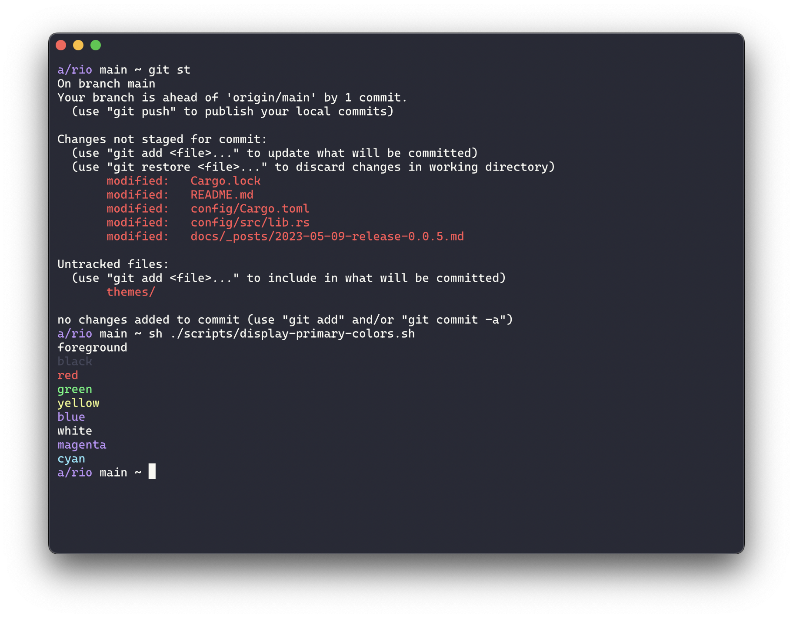

# Themes

> tl;dr: [Click here if you want to see the installing steps](#installing).

| Theme | Example |
| --- | --- | 
| `dracula` [(github.com/raphamorim/rio-dracula)](https://github.com/raphamorim/rio-dracula) |  |
| `lucario` | . |

## Installing

1. Clone Rio repository

```sh
git clone https://github.com/raphamorim/rio.git
```

2. Create a folder called `theme` in Rio configuration folder.
3. Move or copy the themes files to there.
4. Change your Rio configuration main file to use the theme you want.

### macOs steps

```sh
# Clone the repository
$ git clone https://github.com/raphamorim/rio.git

# Make sure the Rio folder exists
$ mkdir -p ~/.rio

# Move theme files
$ mkdir -p ~/.rio/themes && mv ~/.rio/themes ~/.rio

# Update your configuration file and specify the theme
$ vim ~/.rio/config.toml
```